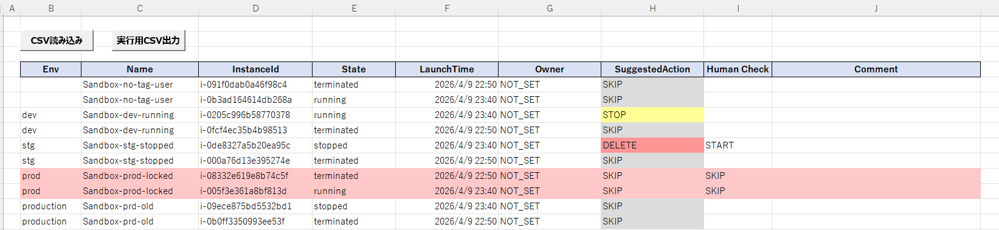

# EC2 Safe Ops（安全志向のクラウド運用自動化ツール）

ヒューマンエラーを防ぐことに特化した、EC2ライフサイクル管理ツールです。
Excelによる人間の判断とCLIによる制御実行を組み合わせ、安全性を重視した運用を実現します。

---

## ■ 概要

本ツールは、EC2インスタンスの起動・停止・削除といった操作において、
**人為的ミスを防止するための多層防御設計**を取り入れたCLIツールです。

従来の「即時実行型スクリプト」とは異なり、

* 人間による事前確認（Excel）
* 構造化されたデータ管理（CSV）
* 制御された実行（CLI）

を組み合わせた **Human-in-the-loop型の運用設計** を採用しています。

---

## ■ 解決した課題

実運用において、以下のようなリスクが存在します：

* 本番環境インスタンスの誤削除
* 対象インスタンスの選択ミス
* 確認なしの一括操作

本ツールはこれらの課題に対し、
**「操作を速くする」のではなく「安全にする」** という思想で設計しています。

---

## ■ Human Verification（人間による承認）



HumanCheck列による明示的な承認がある操作のみ実行される設計としています。
また、SuggestedAction（システム提案）と人間の判断を分離することで、
安全性と運用効率のバランスを取っています。

---

## ■ アーキテクチャ

EC2
↓
EC2情報取得（Python）
↓
Excel（人間による判断）
↓
CSV（実行データ）
↓
CLI実行（Python）
↓
AWS操作（Start / Stop / Delete）
↓
実行履歴のアーカイブ

---

## ■ 主な機能

### ● 人間による最終確認

* Excelベースのレビュー
* HumanCheck列による明示的承認

---

### ● 安全制御（多層防御）

* dry-runがデフォルト
* 本番環境の自動除外（キーワード判定）
* DELETE時の確認処理
* 最大実行数制限
* 実行前整合性チェック
* 実行後の履歴管理

---

### ● 運用フロー最適化

* Excelでの視覚的判断（STOP / DELETE / SKIP）
* ドロップダウンによる入力制御
* VBAによるCSV出力

---

### ● 実行制御

* START / STOP / DELETE対応
* 承認済みデータのみ実行
* アクション単位のフィルタリング

---

## ■ 設計思想（運用自動化に対する考え方）

本ツールは単なるEC2操作ツールではなく、
運用自動化における以下の思想をベースに設計しています。

---

### ● 完全自動化を前提としない

実運用において、すべての判断を自動化することはリスクを伴います。
特に削除や停止といった操作は、誤判断時の影響が大きいため、
あえて人間の判断を介在させる設計としています。

---

### ● ヒューマンエラーは“前提”とする

運用において人為的ミスは避けられないものとして扱い、
「ミスをなくす」のではなく「ミスしても事故にならない」構造を重視しています。

---

### ● 多層防御（Defense in Depth）

単一のチェックに依存せず、複数の安全機構を組み合わせることで、
誤操作のリスクを段階的に低減しています。

---

### ● 人間の判断とシステムの役割分離

* システム：候補提示（SuggestedAction）
* 人間：最終判断（HumanCheck）

という形で責務を分離し、
自動化と安全性のバランスを取っています。

---

### ● MTTR（復旧時間）を意識した設計

障害は発生するものと捉え、
迅速かつ安全に対応できる運用フローを重視しています。

---

### ● 実運用で使えることを最優先

理想的な設計よりも、

* 現場で使いやすいこと
* オペレーターが理解できること
* 手順として定着すること

を重視しています。

---

## ■ クラウドサービス非依存の設計思想

本ツールの設計思想はEC2に限定されたものではなく、
クラウド全体に共通する運用課題に対するアプローチです。

例えば以下のようなケースにも同様の考え方が適用できます：

* S3オブジェクト削除（誤削除防止）
* GCP Compute Engineの停止・削除
* Azure VMのライフサイクル管理
* 各種クラウドリソースの一括操作

これらはいずれも「誤操作時の影響が大きい」という共通点を持っています。

本ツールで採用している

* Human-in-the-loop（人間による最終判断）
* Defense in Depth（多層防御）
* Fail-safe（安全側に倒す設計）

といったアプローチは、
特定のクラウドやサービスに依存しない普遍的な運用設計として適用可能です。

そのため本ツールは単なるEC2操作ツールではなく、
**クラウド運用における安全設計の一例**として位置付けています。

---

## ■ ユースケース

* 運用現場でのEC2一括操作
* オペレーターによる定常作業の安全化
* 本番環境の誤操作防止
* 運用自動化の導入初期段階

---

## ■ 使用方法

### 1. EC2一覧取得

```bash
python src/ec2_app/ec2_report.py
```

---

### 2. Excelで確認

* `excel/ec2_safe_ops.xlsm` を開く
* HumanCheck列を設定

---

### 3. CSV出力

* VBAマクロでCSV生成

---

### 4. 実行

```bash
# Dry-run（デフォルト）
python src/ec2_app/ec2_stop.py

# 実行
python src/ec2_app/ec2_stop.py --execute
```

---

## ■ 安全設計

* DELETE操作は明示的確認必須
* 本番環境は自動除外
* 未承認データは実行不可

---

## ■ 今後の拡張

* AWSタグ連携による自動判定
* 未使用リソース検出
* ポリシーベース制御
* Auto-Healingとの連携

---

## ■ 著者

Akira Takahashi

---

## ■ 補足（面談向け）

本ツールは単なるスクリプトではなく、

* 運用設計
* ヒューマンエラー対策
* 安全性を考慮した自動化

を意識して設計しています。

特に「完全自動化ではなく、安全に制御する」という思想は、
SREの考え方（MTTR改善・事故防止）をベースとしています。
